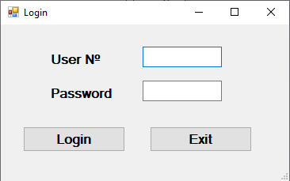
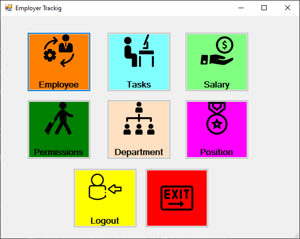
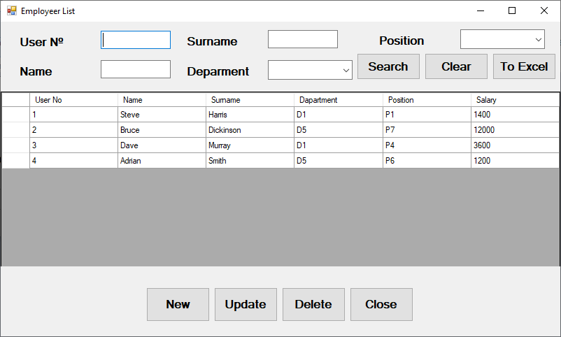
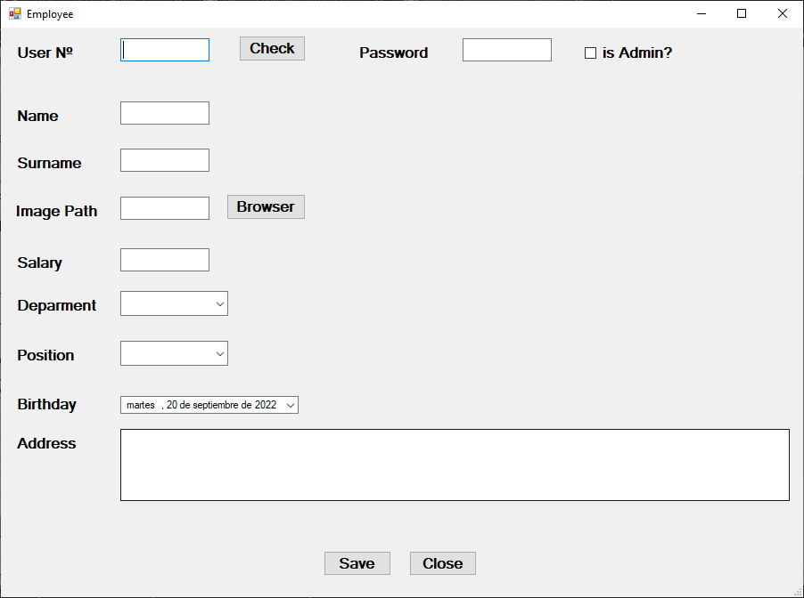
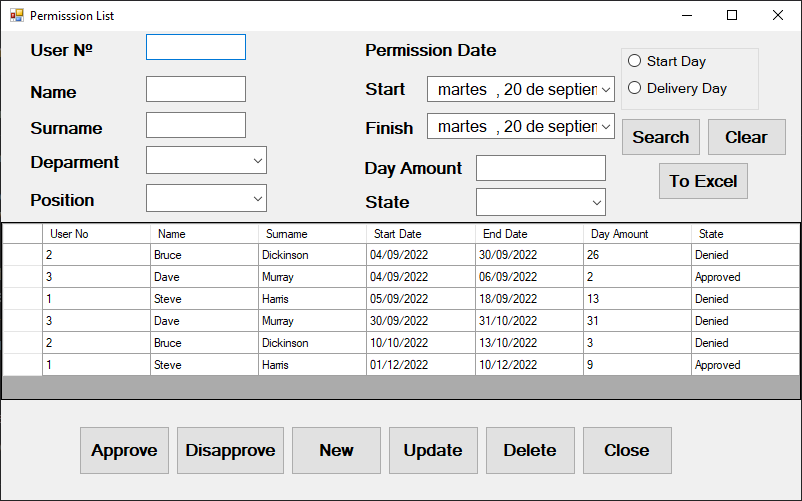
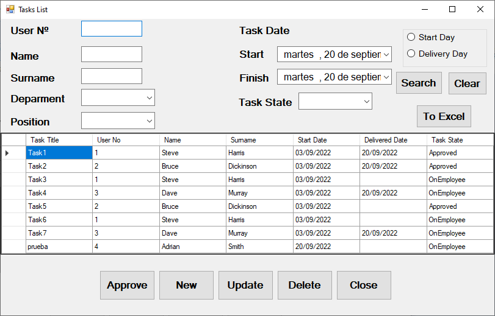

# Personal Tracking
## Sistema de control de empleados y tareas

Personal Tracking es un proyecto realizado con formularios de C# y una base de datos en SQL Server, basado en el Curso de Frogames Formación denominado "Programación Orientada a Objetos con C#".

Esta aplicación distingue por roles, de tal forma que tendremos usuarios administradores que tendran una serie de opciones para aprobar o desaprobar tareas o permisos (vacaciones) y usuarios rasos que solo podrán editar sus datos.

Una opción extra que nos aporta la aplicación es que podremos exportar a Excel los listados de empleados, salarios, tareas y permisos (vacaciones).

A continuación se adjuntan algunas capturas de la aplicación:

